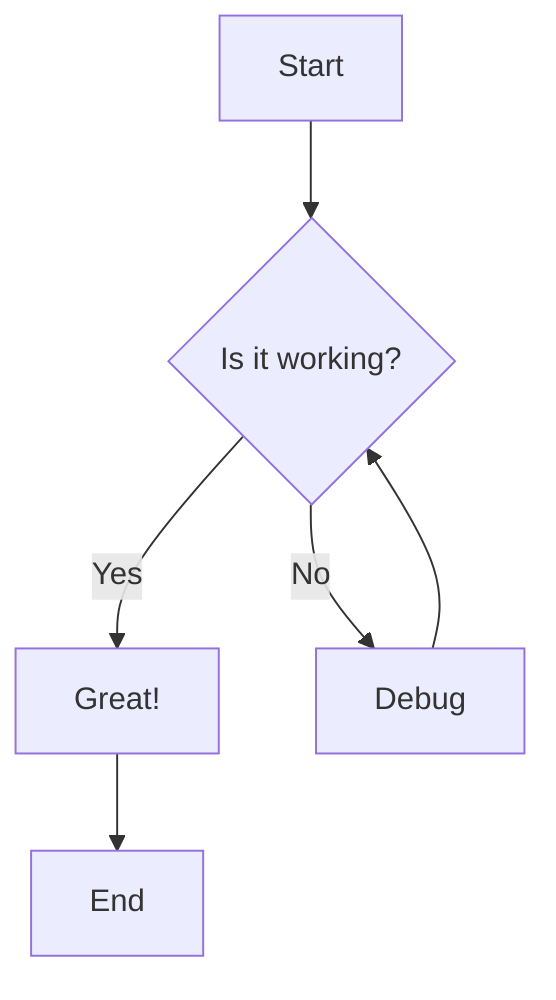
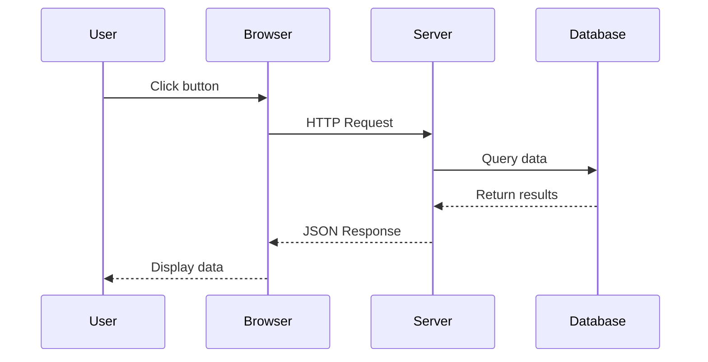
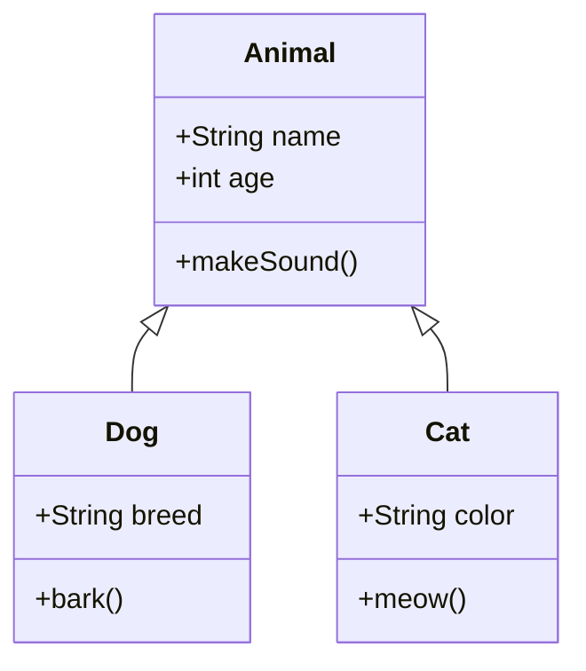

## Flowchart Example

Here's a simple flowchart showing a decision process:

## Sequence Diagram Example

Here's a sequence diagram showing a typical API request flow:

## Class Diagram Example

If you can see the diagrams above as SVG images (not code blocks), Mermaid is working correctly!
